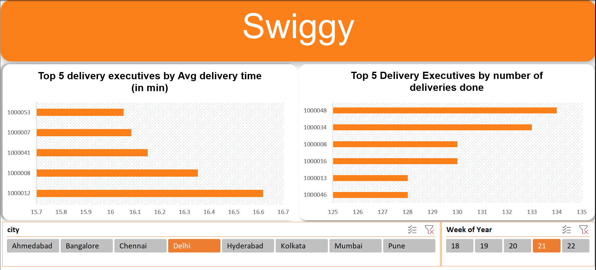

# GrayQuest
Swiggy - Business Case Study

## Problem Statement
To create 1 month orders delivery data for Swiggy with 100k rows with the columns  i.e delivery person id, order id [unique], order value, order quantity, city, order timestamp, order pickup timestamp , delivery timestamp, order rating. Where all orders are placed and delivered. We have 8 cities to work with. We need to answer the Sales Manager questions for us :
To reward top 5 delivery executives for each city per week
Design framework to get results in excel by selecting city
Be prudent in your judgement basis real world scenarios

## Dataset Generation
The "Dataset Generation.txt" file contains all the steps to the generation of the dataset.

## Excel File
"Base" and "Delivery" sheets were used for dataset generation. "Data Model" sheet has the final raw data used for the analysis. "Main Table" has the table generated after transformation of data in power query. "PivotTables" sheet has both the pivot tables and charts used. "Dashboard" sheet contains the final solution. 

## Solution
An Excel dashboard which returns the top 5 delivery executives based on average delivery time and on number of deliveries made with two filters (i.e City and week).

